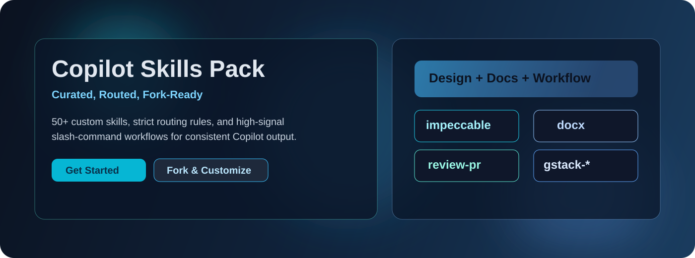
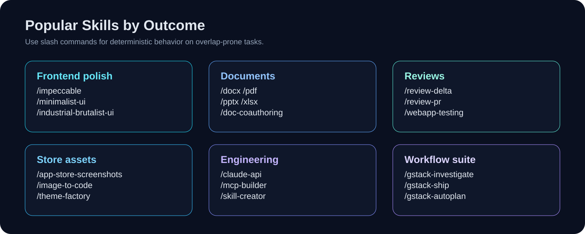
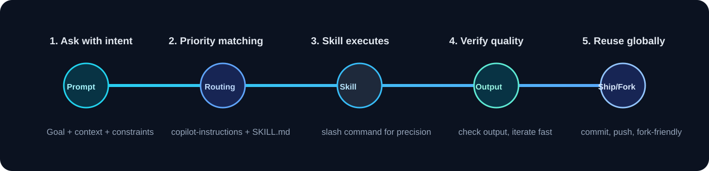

# Copilot Skills Pack

Production-ready custom skills for GitHub Copilot, with clear routing so the right skill is selected at the right time.

This repository is designed to be immediately useful after clone, and easy to fork/customize for your own team workflows.

<p align="center">
  
</p>

<p align="center">
  
  
  
  
</p>

## Visual overview

<p align="center">
  
</p>

## Why developers like this repo

<table>
  <tr>
    <td width="33%" valign="top">
      <h3>Predictable skill selection</h3>
      <p>Priority routing and narrow trigger descriptions prevent random skill collisions.</p>
    </td>
    <td width="33%" valign="top">
      <h3>Fast practical workflows</h3>
      <p>Use natural prompts for convenience and slash commands when you need deterministic output.</p>
    </td>
    <td width="33%" valign="top">
      <h3>Fork and scale quickly</h3>
      <p>Everything is repository-based, so teams can clone, fork, and customize with minimal setup.</p>
    </td>
  </tr>
</table>

## Why this repo exists

Most skill packs fail in one of two ways:

- Too many overlapping skills that trigger unpredictably.
- Great skills, but poor onboarding and no clear usage patterns.

This pack solves both:

- Curated skills grouped by practical outcomes.
- Strict routing policy in `.github/copilot-instructions.md`.
- Slash-command-only rules for overlap-prone families.
- Fork-friendly structure with predictable maintenance.

## What you get

- Frontend/UI craftsmanship and design-specific skills.
- App Store / Play Store screenshot generation workflows.
- Document skills (`docx`, `pdf`, `pptx`, `xlsx`).
- Review skills (`review-delta`, `review-pr`).
- Engineering skills (`claude-api`, `mcp-builder`, `skill-creator`, `webapp-testing`).
- GStack workflow family (`gstack-*`, explicit invocation only).

Complete index: `.github/skills/README.md`

## Repository layout

```
.github/
  copilot-instructions.md   # routing and priority policy
  skills/
    <skill-name>/
      SKILL.md              # frontmatter + behavior instructions
      ...                   # optional assets (template/, scripts/, references/)
  skills/README.md          # human-readable skill catalog + test prompts
```

## Quick start (2 minutes)

1. Clone this repo (or your fork).
2. Open it in VS Code.
3. Sign in to GitHub Copilot and Copilot Chat.
4. Start with either natural language prompts or slash commands.

<p align="center">
  
</p>

## How to use skills effectively

### High-conversion usage model

1. Start with natural language for speed.
2. Switch to slash command when precision matters.
3. Keep prompts goal-first and constraint-aware.
4. Iterate with short follow-ups instead of rewriting full prompts.

### Option A: Natural-language routing

Copilot reads:

- `.github/copilot-instructions.md` (workspace routing policy)
- each skill's `description` in `SKILL.md` (trigger surface)

Example prompts:

- `review this PR against main` -> `review-pr`
- `merge these PDFs` -> `pdf`
- `build App Store screenshots for my app` -> `app-store-screenshots`
- `create a Word report with headings and TOC` -> `docx`

### Option B: Explicit slash command (recommended for precision)

Use slash commands when you want deterministic behavior:

- `/impeccable`
- `/app-store-screenshots`
- `/docx`
- `/review-delta`
- `/gstack-investigate`

If a task is sensitive, high-stakes, or overlap-prone, slash invocation is the best UX.

## Best prompt patterns for better outputs

When asking Copilot to use a skill, include:

- **Goal:** what success looks like.
- **Context:** app type, audience, constraints.
- **Output format:** code, checklist, patch, report.
- **Priority:** speed vs polish vs strictness.

Strong examples:

- `Use /impeccable to redesign this pricing page for clarity and conversion. Keep existing React component structure.`
- `Use /review-delta and focus on regressions, security risks, and missing tests.`
- `Use /app-store-screenshots to scaffold Play Store screenshots for a finance app, clean modern style, export-ready assets.`

## Copy-paste prompt starter pack

### Frontend and design

- `Use /impeccable to refactor this landing page into a cleaner conversion-first layout. Keep existing content, improve hierarchy and spacing.`
- `Use /minimalist-ui to redesign this dashboard in an editorial style with strong typography and low visual noise.`
- `Use /app-store-screenshots to generate App Store + Play Store marketing screenshots for a fitness app with bold headline copy.`

### Reviews and quality

- `Use /review-delta and only report regressions, security risks, and missing tests from changed files.`
- `Use /review-pr and compare this branch with main. Prioritize functional risks and rollout concerns.`
- `Use /webapp-testing to run a smoke test plan and summarize UI issues with repro steps.`

### Documents and deliverables

- `Use /docx to create a polished project proposal with title page, TOC, and clear sectioning.`
- `Use /pdf to merge these reports and add page numbers and a watermark.`
- `Use /pptx to build a 10-slide investor narrative with speaker notes.`

### Engineering and workflow

- `Use /claude-api to add prompt caching and show expected cache-hit improvements.`
- `Use /mcp-builder to scaffold a production-ready MCP server for a ticketing API.`
- `Use /gstack-investigate to run a root-cause-first bug analysis for this error.`

## Routing model (important)

This repo intentionally prevents skill collisions.

- `impeccable` is the default for general frontend polish and redesign.
- `frontend-design`, `design-taste-frontend`, `redesign-existing-projects`, and `emil-design-eng` are explicit-invocation only.
- `gstack-*` is explicit-invocation only.

If you change routing, keep priorities strict or trigger quality will degrade.

## Forking guide (recommended)

1. Fork this repository.
2. Edit `.github/copilot-instructions.md` for your team's routing preferences.
3. Tune `description` fields in skill frontmatter to match your wording.
4. Remove skills you do not use to reduce accidental triggering.
5. Add your own skills in `.github/skills/<name>/`.
6. Keep `.github/skills/README.md` in sync.

## Adding a new skill correctly

1. Copy the skill folder to `.github/skills/<skill-name>/`.
2. Verify `SKILL.md` frontmatter:
   - `name:` exactly matches folder name.
   - `description:` has clear, specific trigger phrases.
3. Copy required sibling assets (for example `template/`, `scripts/`, `references/`).
4. Register the skill in:
   - `.github/skills/README.md`
   - `.github/copilot-instructions.md`
5. Commit and push.

## Troubleshooting

### Skill is not triggering

- Use slash command directly to validate it works.
- Check `name` and folder match.
- Tighten `description` trigger wording.
- Verify no higher-priority routing rule is catching the prompt first.

### Wrong skill triggers

- Make overlapping skills explicit-invocation only.
- Move the intended skill earlier in routing priority.
- Narrow broad description text.

### Works on one machine but not another

- Ensure all `.github/` files are committed and pushed.
- Clone the same repository/fork on the other machine.
- Open that folder in VS Code while signed into Copilot.

### README images do not render

- Verify image paths exist under `assets/readme/`.
- Use repository-relative paths (already used in this README).
- Ensure your Git hosting viewer allows inline SVG rendering.

## Contributing

Issues and PRs are welcome.

Please include in PRs:

- Why routing changed.
- What overlap risks were considered.
- Before/after example prompts.
- Any migration impact for existing users.

## License and attribution

Imported skills may include their own license/notice requirements. Keep attribution files (`LICENSE.txt`, `NOTICE.md`, source references) intact when redistributing.
